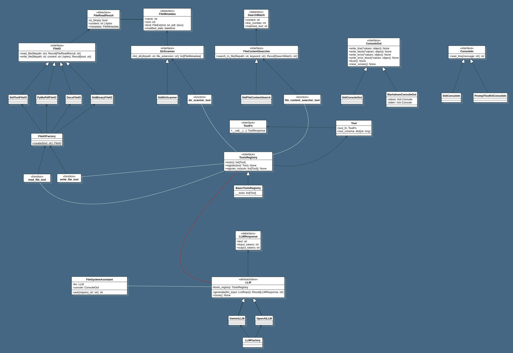

# File System Assistant

## UML Class Diagram



---

## Requirements

### 1. Set the `GOOGLE_API_KEY` or `OPENAI_API_KEY` Environment Variable

The application requires a valid Google or OpenAI API key.

#### macOS / Linux

```bash
export GOOGLE_API_KEY="your_api_key_here"
```
or

```bash
export OPENAI_API_KEY="your_api_key_here"
```

#### Windows (PowerShell)

```powershell
setx GOOGLE_API_KEY "your_api_key_here"
```
or 

```powershell
setx OPENAI_API_KEY "your_api_key_here"
```

Restart your console.

---

## Setup

### Clone the Repository

```bash
git clone https://github.com/ks6201/file-system-assistant.git
```

```bash
cd file-system-assistant
```

---

## Run the Application

### Recommended: Run Locally with `uv`

#### Additional Requirement (Local Only)

Install `uv`:

##### macOS / Linux

```bash
curl -LsSf https://astral.sh/uv/install.sh | sh
```

##### Windows (PowerShell)

```powershell
irm https://astral.sh/uv/install.ps1 | iex
```

Verify:

```bash
uv --version
```

Restart the terminal if necessary.

---

### Install Dependencies

```bash
uv sync
```

### Run

```bash
uv run fsa-app
```

---

### Alternative Option: Docker Compose

This method provides a consistent runtime and avoids local dependency management.

#### Requirements

* Docker
* Docker Compose

#### Run

```bash
docker compose run --rm fsa-app
```

**Notes**

* `--rm` removes the container after execution.
* Ensure `GOOGLE_API_KEY` or `OPENAI_API_KEY` is available to Docker (environment or compose config).

---

#### Build & Run

```bash
docker compose run --rm --build fsa-app
```
